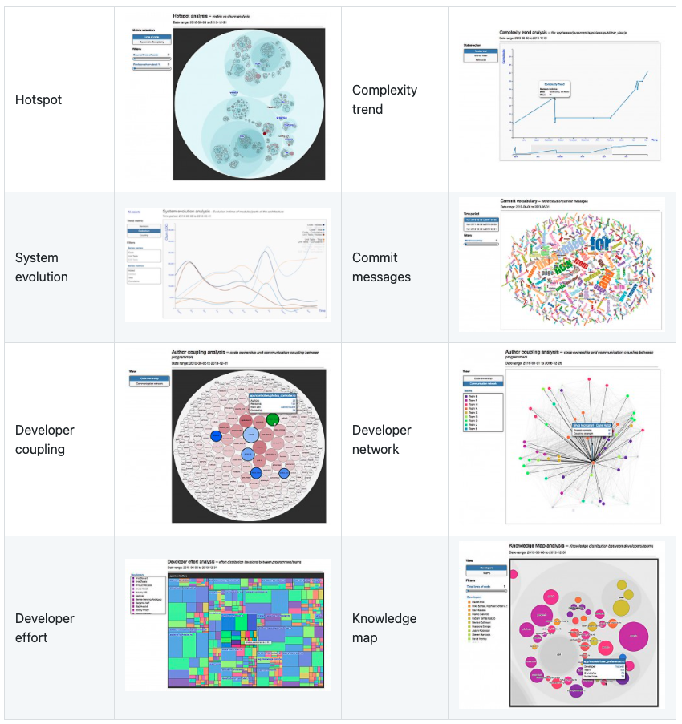

# Code Forensics Maven Plugin
Maven plugin to easily add code-forensics tools from [Silvio Montanari](https://github.com/smontanari/) to your java projects.  
code-forensics is a toolset for analysing codebase stored in a version control system.

It leverages the repository logs, or version history data, to perform deep analysis by :
 * Looking at complexity,logical coupling, authors coupling
 * Inspecting the evolution in time of different parts of a software system
 * Analyzing metrics like code churn and number of revisions

More info about [code-forensics](https://github.com/smontanari/code-forensics/wiki)



## How to use this plugin ?
* Make the plugin available in your organization package manager repository
* Simply add your dependency in your pom.xml
```xml
<plugin>
    <groupId>com.ythirion.codeforensics</groupId>
    <artifactId>code-forensics-maven-plugin</artifactId>
    <version>1.0-SNAPSHOT</version>
</plugin>
```

## Prerequisites
* **Node.js** : Nodejs 4 or later
* **npm v3** - code-forensics requires a flat install of its dependencies into the node_modules folder in order to visualise d3 diagrams

## Configuration
### Gulpfile configuration
To override the default configuration of the tool :
* Add a `gulpfile.js` at the root of your project
* In your `pom.xml` file configure the plugin
```xml
<configuration>
    <useProjectGulpFile>true</useProjectGulpFile>
</configuration>
```

#### Example of configuration
```javascript
require('code-forensics').configure(
  {
    repository: {
      rootPath: "{repositoryPath}",
      excludePaths: [
        'src/example'
      ]
    }
  }
);
```
> Keep the `{repositoryPath}` variable. It will be replaced by the plugin at runtime.

Check the [code-forensics documentation](https://github.com/smontanari/code-forensics/wiki/Configuration) to understand what you can do with it (contributors, exclude paths, system boundaries, ...).